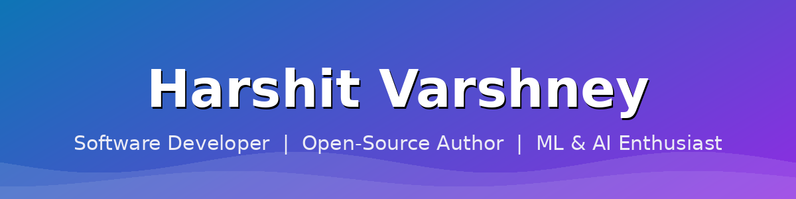

<!-- ====== ANIMATED HEADER BANNER ====== -->


<!-- ====== TYPING ANIMATION ====== -->
<div align="center">
  
[](https://git.io/typing-svg)

</div>

<!-- ====== BADGES ROW ====== -->
<div align="center">


<a href="https://github.com/Varshneyhars?tab=followers"></a>
<a href="https://github.com/Varshneyhars?tab=repositories"></a>


</div>

---

## 🌐 Connect With Me

<div align="center">

<a href="https://linkedin.com/in/harshitvars"></a>
<a href="https://x.com/HarshitVar32225"></a>
<a href="mailto:varshney.harshit@outlook.com"></a>
<a href="https://github.com/Varshneyhars/Portfolio"></a>

</div>

---

## 🧑‍💻 About Me

```python
class HarshitVarshney:
    def __init__(self):
        self.role        = "Software Developer"
        self.location    = "Gwalior, India"
        self.languages   = ["JavaScript", "TypeScript", "Python", "PHP"]
        self.focus       = ["Full-Stack Web", "Developer Tooling", "Machine Learning", "AI"]
        self.philosophy  = "Clean code, great docs, ship things people use"

    def current_work(self):
        return [
            "📦 Publishing open-source npm libraries",
            "🤖 Building ML & AI-powered tools",
            "🌱 Leveling up in scalable backends & system design",
        ]
```

> 💡 I turn ideas into reliable, well-documented software — from npm libraries other developers plug straight in, to machine-learning models and AI tools that solve real problems.

---

## 🛠️ Tech Stack

#### 💻 Languages


#### ⚛️ Frontend


#### 🔧 Backend


#### 🗄️ Databases


#### 🤖 Machine Learning & Data


#### ☁️ Cloud & Deployment


#### ⚙️ DevOps & Tools


---

## 📌 Featured Projects

<div align="center">

<a href="https://github.com/Varshneyhars/advanced-key-generator">
  
</a>
<a href="https://github.com/Varshneyhars/ai-bg-remover">
  
</a>
<a href="https://github.com/Varshneyhars/Spam-Message-Classifier">
  
</a>
<a href="https://github.com/Varshneyhars/advanced-email-existence">
  
</a>

</div>

| Project | What it does | Stack |
| :------ | :----------- | :---- |
| 🔑 [**advanced-key-generator**](https://github.com/Varshneyhars/advanced-key-generator) | Node.js library for secure, customizable API keys & tokens — random strings, bytes, Base32, Base62, UUIDs. | `JS` `Node.js` |
| 🖼️ [**ai-bg-remover**](https://github.com/Varshneyhars/ai-bg-remover) | High-performance AI background remover, inspired by remove.bg. | `Python` `AI` |
| 📩 [**Spam-Message-Classifier**](https://github.com/Varshneyhars/Spam-Message-Classifier) | ML model classifying SMS as spam / not spam. | `Python` `scikit-learn` `NLTK` |
| ✉️ [**advanced-email-existence**](https://github.com/Varshneyhars/advanced-email-existence) | Utility to verify whether an email address really exists. | `JavaScript` |
| 🌐 [**Portfolio**](https://github.com/Varshneyhars/Portfolio) | My personal portfolio website. | `HTML` `CSS` |

---

## 📊 GitHub Analytics

<div align="center">


<br/>


</div>

---

## 🏆 GitHub Trophies

<div align="center">


</div>

---

## 📈 Contribution Graph

<div align="center">


</div>

---

<div align="center">

### ⭐ Thanks for visiting — feel free to explore my repos and drop a star!


</div>
